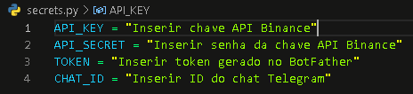
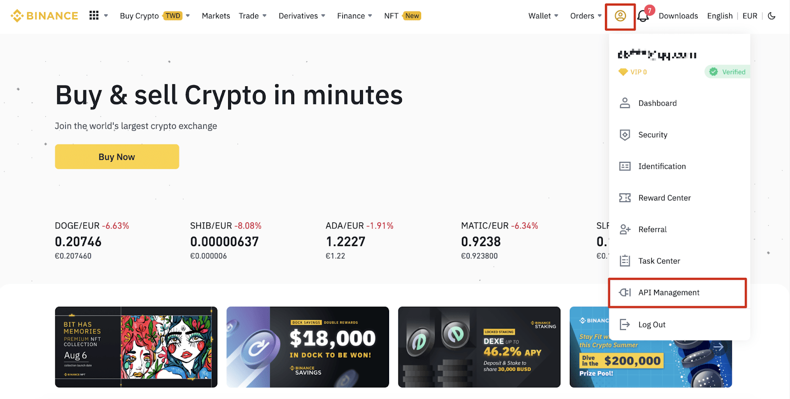
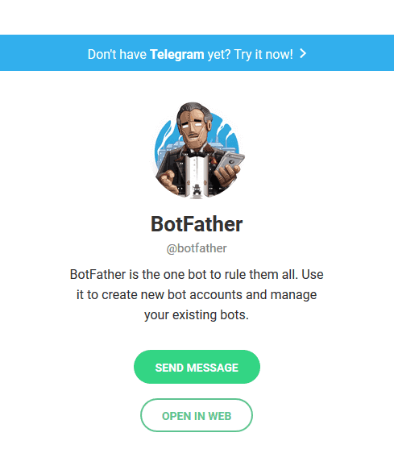
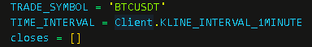
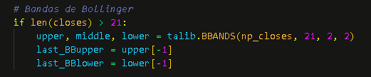
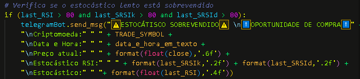

# **ROBÔ DE SINAIS BINANCE - TELEGRAM** <h1>

O robô de sinal **PyTrader** realiza o monitoramento dos pares de criptomoedas e envia mensagens de alertas via **Telegram**. Com diversos indicadores e tempos gráficos customizavéis, é uma excelente opção para quem quer ficar por dentro das oportunidades e regiões de preços importantes.

## **MANUAL DE UTILIZAÇÃO** <h2>

 

No arquivo **"secrets.py"**
  

  

deverá ser inserida a **API_KEY** da sua conta Binance juntamente de sua senha **API_ SECRET**. Ambos podem ser obtidos nas configurações da sua conta Binance, adentrando na opção **API Management**:

  

Ainda no arquivo **"secrets.py"**, para inserir o **TOKEN** é necessário criar um bot no Telegram utilizando o canal **BotFather**:

  

Para capturar o **CHAT_ID**, é necessário entrar no site [https://api.telegram.org/TOKEN/getUpdates] e substituir o TOKEN. Em seguida, basta enviar uma mensagem através do telegram e atualizar o site. o número do chat aparece na string: {"message_id":xxx,"from":{"id":**Número ID**.

  

Pode-se alterar a criptomoeda a ser analisada substituindo-a em **TRADE_SYMBOL**, bem como seu tempo gráfico.
  

  

Os indicadores podem ser customizados e inseridos a seu critério acessando a biblioteca **Talib** no site [https://mrjbq7.github.io/ta-lib/funcs.html]. Estes indicadores podem ser configurados como na imagem abaixo:
  

  

Para customizar ou adicionar uma mensagem que será enviada no Telegram, é necessário utilizar o **telegramBot.send_msg** como na imagem abaixo:
  

  

